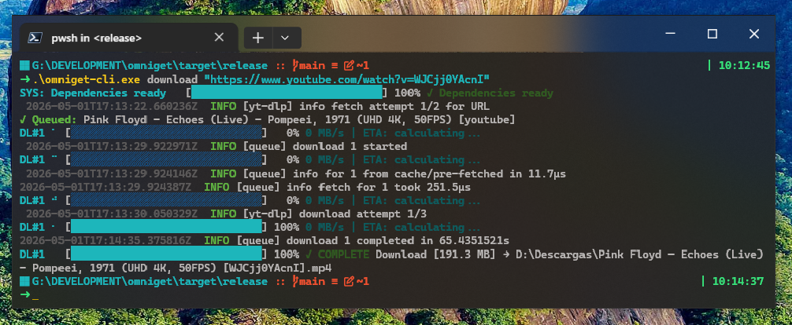

<h1 align="center">OmniGet</h1>

<p align="center">
  
</p>

<p align="center">
  <strong>Download media from 1000+ sites — terminal-first.</strong><br>
  A lightweight, standalone download manager for video, audio, and files.
</p>

<p align="center">
  <a href="https://github.com/julesklord/omniget/releases/latest"></a>
  <a href="LICENSE"></a>
  <a href="https://github.com/julesklord/omniget/stargazers"></a>
  
</p>

---

## Overview

**OmniGet** is a terminal-first download manager written in Rust. It supports video, audio, and file downloads across 1000+ websites, powered by [yt-dlp](https://github.com/yt-dlp/yt-dlp).

No GUI bloat. No Electron. Just a fast, self-contained binary.

## Features

| Feature | Description |
|---------|-------------|
| **Multi-platform downloads** | YouTube, Instagram, TikTok, Twitter/X, Reddit, Twitch, Pinterest, Vimeo, Bluesky, Bilibili, and 1000+ more |
| **Batch processing** | Download multiple URLs from a text file in one command |
| **Auto dependencies** | yt-dlp and FFmpeg are downloaded automatically on first run |
| **Progress tracking** | Real-time progress bars with speed and download phase |
| **Queue management** | Concurrent downloads with session persistence |
| **Settings system** | Read, write, and list configuration via JSON path notation |
| **Activity logs** | Tail application logs from the terminal |
| **Audio extraction** | Download audio-only streams with `--audio-only` |

## Installation

### Install with Cargo

You can install OmniGet directly from [crates.io](https://crates.io/crates/omniget-cli):

```bash
cargo install omniget-cli
```

### Precompiled binaries

1. Go to the [Releases page](https://github.com/julesklord/omniget/releases/latest).
2. Download the binary for your OS (`.exe` for Windows, ELF for Linux/macOS).
3. Add it to your PATH.

### From source

```pwsh
git clone https://github.com/julesklord/omniget.git
cd omniget
cargo build --release
```

Binary is at `target/release/omniget-cli`.

### Prerequisites

- [Rust](https://rustup.rs/) 1.70+ (stable)
- Git

All runtime dependencies (yt-dlp, FFmpeg) are managed automatically.

## Usage

```pwsh
omniget-cli [OPTIONS] <COMMAND>
```

### Global options

| Option | Description |
|--------|-------------|
| `-v`, `--verbose` | Enable verbose logging |
| `--theme <THEME>` | Theme: `brutalist`, `zen`, or `auto` |
| `--ascii-only` | Force ASCII-only output (no Unicode) |

### `download` — Download media from a URL

```pwsh
omniget-cli download <URL> [OPTIONS]
```

| Option | Description |
|--------|-------------|
| `-o`, `--output <DIR>` | Output directory (default: system Downloads) |
| `-q`, `--quality <QUALITY>` | Target quality, e.g. `1080p`, `720p` |
| `-a`, `--audio-only` | Extract audio only |

**Examples:**

```bash
omniget-cli download "https://www.youtube.com/watch?v=dQw4w9WgXcQ" -q 1080p
omniget-cli download "https://www.youtube.com/watch?v=dQw4w9WgXcQ" --audio-only -o ~/Music
omniget-cli download "https://www.instagram.com/reel/ABC123/"
```

### `download-multiple` — Batch download from a file

```bash
omniget-cli download-multiple urls.txt -o ~/Videos
```

One URL per line.

### `info` — Inspect media metadata

```bash
omniget-cli info "https://www.youtube.com/watch?v=dQw4w9WgXcQ"
```

### `list` — List queue items

```bash
omniget-cli list [--active] [--queued] [--completed] [--failed]
```

### `clean` — Clear download history

```bash
omniget-cli clean [--finished] [--failed]
```

### `config` — Manage settings

```bash
omniget-cli config list
omniget-cli config get download.default_output_dir
omniget-cli config set download.video_quality "1080p"
```

### `check` — Verify dependencies

```bash
omniget-cli check
```

Downloads missing yt-dlp / FFmpeg if needed.

### `update` — Force-update internal deps

```bash
omniget-cli update
```

### `logs` — View activity logs

```bash
omniget-cli logs --tail 50
```

### `about` — App info

```bash
omniget-cli about [version|roadmap|changelog|terms]
```

## Supported platforms

### Media platforms

| Platform | Content |
|----------|---------|
| YouTube | Videos, Shorts, Playlists |
| Instagram | Posts, Reels |
| TikTok | Videos |
| Twitter / X | Videos, GIFs |
| Reddit | Videos, Images |
| Twitch | Clips |
| Pinterest | Images, Videos |
| Vimeo | Videos |
| Bluesky | Images, Videos |
| Bilibili | Videos, Series |

### Additional

- **Torrent / Magnet**: via built-in client (`librqbit`)
- **Generic yt-dlp**: 1000+ sites
- **P2P file sharing**: planned

## Architecture

```plain
omniget/
├── omniget-cli/          # CLI binary (clap + indicatif)
│   └── src/
│       ├── main.rs       # Command dispatch
│       └── reporter.rs   # Terminal UI
│
├── omniget-core/         # Download engine
│   └── src/
│       ├── core/         # Queue, HTTP, ytdlp, cookies, HLS
│       ├── platforms/    # YouTube, Instagram, TikTok, etc.
│       └── models/       # Shared data types
│
└── omniget-plugin-sdk/   # Plugin extension SDK
```

| Crate | Role |
|-------|------|
| `omniget-cli` | Standalone CLI binary |
| `omniget-core` | **The engine** — platform-agnostic download logic, queue, dependency management |
| `omniget-plugin-sdk` | SDK for extending download capabilities |

## Configuration

Settings stored in the OS app data directory:

| OS | Path |
|----|------|
| Windows | `%APPDATA%\omniget\` |
| macOS | `~/Library/Application Support/omniget/` |
| Linux | `~/.local/share/omniget/`

Portable mode: place `portable.txt` or `.portable` next to the binary to use a local `data/` folder instead.

## Roadmap

| Version | Milestone |
|---------|-----------|
| **v0.2.0** | Standalone rewrite — GUI removed, core refactored ✅ |
| **v0.3.0** | Interactive TUI mode (`ratatui`) |
| **v0.4.0** | Plugin system |
| **v0.5.0** | P2P file sharing |

## Related projects

- [yt-dlp](https://github.com/yt-dlp/yt-dlp) — Media extraction engine

## Contributing

See [CONTRIBUTING.md](CONTRIBUTING.md) for guidelines.

## License

[GPL-3.0](LICENSE)
